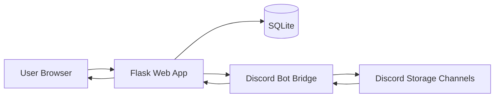

# NovaDrive

**NovaDrive** is a Google Drive inspired web app that uses **Discord as the storage backend**.

Instead of pushing uploads to S3 or saving them permanently on local disk, NovaDrive buffers incoming files temporarily, splits them into Discord-safe chunks, uploads those chunks through a `discord.py` bot bridge, and stores the full manifest in SQLite for download, verification, search, sharing, and administration.

It is designed as a **real, production-structured MVP**, not a throwaway demo.

## Why NovaDrive exists

NovaDrive explores a fun but serious architectural idea:

- Use Discord channels as the durable blob store
- Use Flask + SQLAlchemy as the control plane
- Use SQLite for metadata, indexing, manifests, and auditability
- Keep uploads verifiable with SHA256 at both chunk and file level
- Make the UX feel like a real startup product, not an admin dashboard from 2015

This repo gives you a clean base to keep building from.

## Highlights

- Secure authentication with hashed passwords and signed session cookies
- Automatic first-user admin bootstrap
- Optional SMTP-backed email verification for account activation
- WebDAV support for direct upload, download, folder creation, delete, and move from desktop/mobile clients
- Nested folders with ownership-aware create, move, rename, and delete flows
- File upload, rename, move, soft delete, hard delete, and verified download
- ShareX-compatible file, image, and text uploads with per-user API keys and generated `.sxcu` config
- Discord chunk manifests stored in SQLite with message IDs, channel IDs, URLs, and checksums
- Share links with optional expiry, inline media playback, raw links, and text file rendering
- Search, filtering, recent activity, storage usage summaries, and admin health visibility
- Modular service layer with a storage abstraction so Discord can be swapped later
- Docker and Docker Compose support plus a GitHub Actions image build workflow
- Dark premium UI with Tailwind, Jinja, glassmorphism panels, and polished dashboard flows

## Tech stack

- **Backend:** Python
- **Web framework:** Flask
- **Database:** SQLite with SQLAlchemy
- **Migrations:** Flask-Migrate / Alembic
- **Auth:** Flask-Login + Flask-WTF + Werkzeug password hashing
- **Discord integration:** `discord.py` bot with a local HTTP bridge
- **Frontend:** Jinja2 templates + Tailwind CSS + a small amount of vanilla JavaScript

## Architecture at a glance



### Request flow

1. A user uploads a file through the web UI.
2. Flask buffers the file temporarily in a spooled temp file.
3. NovaDrive computes the full-file SHA256 while streaming the upload.
4. The file is split into chunks smaller than the configured Discord attachment threshold.
5. Each chunk is sent to the Discord bot bridge.
6. The bot uploads the chunk as a Discord attachment into a configured storage channel.
7. NovaDrive stores the returned Discord message IDs, channel IDs, attachment URLs, chunk checksums, and manifest metadata in SQLite.
8. On download, NovaDrive fetches the chunks back in order, verifies each chunk hash, rebuilds the file, verifies the final SHA256, and serves the file to the client.

## Why there are two processes

NovaDrive intentionally separates the web app and the Discord bot:

- The **Flask app** owns HTTP requests, sessions, forms, templates, and database writes.
- The **Discord bot** owns Discord connectivity, attachment uploads, message fetches, and deletion.

That split keeps the codebase cleaner and avoids mixing Flask request handling with long-lived async Discord state. It also makes it easier to swap the bot bridge implementation later if you want to move to a queue, worker, or internal RPC layer.

## Project structure

```text
novadrive/
  app.py                  Flask app factory and CLI commands
  config.py               Environment-driven configuration
  discord_bot.py          Discord bot + local HTTP bridge
  extensions.py           Flask extension instances
  forms.py                WTForms definitions
  models.py               SQLAlchemy models
  routes/                 Flask blueprints
  services/               Business logic and storage orchestration
  static/                 Tailwind source, built CSS, and JS
  templates/              Jinja layouts and pages
  utils/                  Hashing, chunking, validation, logging helpers
migrations/               Migration notes / future Alembic output
run.py                    Simple app runner
requirements.txt          Python dependencies
package.json              Tailwind build tooling
tailwind.config.js        Tailwind theme config
.env.example              Environment template
README.md                 You are here
```

## Core modules

- [novadrive/app.py](novadrive/app.py): app factory, error handlers, CLI commands
- [novadrive/models.py](novadrive/models.py): users, folders, files, manifests, chunks, share links, activity, sessions
- [novadrive/services/file_service.py](novadrive/services/file_service.py): uploads, chunk orchestration, rename/move/delete, rebuild validation
- [novadrive/services/discord_storage.py](novadrive/services/discord_storage.py): HTTP client for the bot bridge
- [novadrive/discord_bot.py](novadrive/discord_bot.py): live Discord upload/fetch/delete logic
- [novadrive/routes](novadrive/routes): auth, dashboard, files, folders, share, and admin blueprints

## Feature coverage

### Authentication

- User registration
- User login/logout
- Password hashing
- Session cookie auth
- First registered user becomes admin
- Optional email verification before password login and WebDAV access
- Basic `admin` and `user` role model with admin role reassignment from the admin console

### File management

- Upload files into Discord-backed storage
- Chunk files below Discord limits
- Persist chunk metadata in SQLite
- Rebuild files in exact order
- Validate chunk checksums and final file hash
- Rename, move, view metadata, soft delete, hard delete
- Duplicate filename conflict handling

### Folder system

- Nested folders
- Create, rename, move, delete
- Ownership-aware access checks
- Breadcrumb navigation and folder tree rendering

### Sharing

- Tokenized share links
- Optional expiry
- Public download by token
- Public image, video, audio, and text previews by token
- Global sharing toggle via config

### WebDAV

- Basic-auth WebDAV endpoint scoped to the authenticated user's drive
- `PROPFIND`, `GET`, `HEAD`, `PUT`, `MKCOL`, `DELETE`, `MOVE`, and `OPTIONS`
- Desktop and mobile client support using normal NovaDrive credentials
- Works for verified multi-user accounts without exposing the global admin view

### ShareX uploads

- Header-authenticated upload API for ShareX custom uploaders
- Per-user API key generation and revocation
- One-click `.sxcu` export from the dashboard
- File, image, and text upload support through the same endpoint
- Share link response payloads with preview, raw, and download URLs

### Admin surface

- User list
- File, folder, and storage totals
- Recent activity log
- Discord bot bridge health snapshot
- Storage config visibility

## Quick start

If you just want to boot NovaDrive locally, this is the fastest path.

### 1. Create a Python virtual environment

Windows PowerShell:

```powershell
python -m venv .venv
.venv\Scripts\Activate.ps1
```

Linux or macOS:

```bash
python -m venv .venv
source .venv/bin/activate
```

### 2. Install Python dependencies

```bash
pip install -r requirements.txt
```

### 3. Install frontend tooling and build Tailwind

```bash
npm install
npm run build:css
```

Use this during UI work:

```bash
npm run watch:css
```

### 4. Create your environment file

Copy `.env.example` to `.env` and fill in the required values:

```bash
cp .env.example .env
```

Windows PowerShell alternative:

```powershell
Copy-Item .env.example .env
```

At minimum, set:

- `SECRET_KEY`
- `DISCORD_BOT_TOKEN`
- `DISCORD_GUILD_ID`
- `DISCORD_STORAGE_CHANNEL_IDS`
- `DISCORD_BOT_BRIDGE_SHARED_SECRET`

### 5. Initialize the database

Quick bootstrap:

```bash
flask --app novadrive.app:create_app init-db
```

Migration-based workflow:

```bash
flask --app novadrive.app:create_app db init
flask --app novadrive.app:create_app db migrate -m "Initial schema"
flask --app novadrive.app:create_app db upgrade
```

### 6. Start the web app

```bash
flask --app novadrive.app:create_app run --debug
```

Alternative:

```bash
python run.py
```

### 7. Start the Discord bot bridge in another terminal

```bash
python -m novadrive.discord_bot
```

### 8. Open NovaDrive

Visit:

```text
http://127.0.0.1:5000
```

Register the first account. That user becomes the initial admin automatically.

If `EMAIL_VERIFICATION_REQUIRED=true`, new accounts must confirm their email before normal login and WebDAV access are enabled.

## Discord setup guide

To make the storage layer work properly:

1. Create a bot application in the Discord Developer Portal.
2. Generate a bot token and place it in `DISCORD_BOT_TOKEN`.
3. Invite the bot to your Discord server.
4. Create one or more private channels to act as storage buckets.
5. Put those channel IDs into `DISCORD_STORAGE_CHANNEL_IDS`, comma-separated.
6. Set `DISCORD_GUILD_ID` to the target server ID.

Recommended bot permissions:

- View Channels
- Send Messages
- Attach Files
- Read Message History
- Manage Messages

`Manage Messages` is needed if you want hard-delete support to remove Discord chunk messages.

## Environment variables reference

| Variable | Purpose | Example |
| --- | --- | --- |
| `SECRET_KEY` | Flask session signing secret | `super-long-random-secret` |
| `DATABASE_URL` | SQLAlchemy database URL | `sqlite:///instance/novadrive.db` |
| `APP_EXTERNAL_URL` | Public app URL used in verification emails | `https://drive.example.com` |
| `MAX_UPLOAD_SIZE_BYTES` | Max allowed file size through Flask | `536870912` |
| `SPOOL_MAX_MEMORY_BYTES` | Max in-memory temp spool before disk spill | `8388608` |
| `TEXT_PREVIEW_MAX_BYTES` | Max text bytes rendered inline on preview pages | `1048576` |
| `ALLOW_PUBLIC_SHARING` | Enables share link generation | `true` |
| `SOFT_DELETE_ENABLED` | Keeps deleted items out of active view by default | `true` |
| `WEBDAV_ENABLED` | Enables the built-in WebDAV endpoint | `true` |
| `WEBDAV_REALM` | HTTP auth realm shown to WebDAV clients | `NovaDrive WebDAV` |
| `EMAIL_VERIFICATION_REQUIRED` | Require email confirmation before password login | `true` |
| `EMAIL_VERIFICATION_MAX_AGE_SECONDS` | Verification link lifetime | `86400` |
| `EMAIL_VERIFICATION_RESEND_INTERVAL_SECONDS` | Minimum resend interval | `60` |
| `SMTP_HOST` | SMTP host for outbound mail | `smtp.mailgun.org` |
| `SMTP_PORT` | SMTP port | `587` |
| `SMTP_USERNAME` | SMTP username | `postmaster@example.com` |
| `SMTP_PASSWORD` | SMTP password | `...` |
| `SMTP_USE_TLS` | Enable STARTTLS | `true` |
| `SMTP_USE_SSL` | Connect with SMTPS | `false` |
| `SMTP_FROM_EMAIL` | Sender email address | `noreply@example.com` |
| `SMTP_FROM_NAME` | Sender display name | `NovaDrive` |
| `SMTP_TIMEOUT_SECONDS` | SMTP connection timeout | `20` |
| `DISCORD_BOT_TOKEN` | Bot token for Discord connectivity | `...` |
| `DISCORD_GUILD_ID` | Discord server ID | `123456789012345678` |
| `DISCORD_STORAGE_CHANNEL_IDS` | Comma-separated storage channel IDs | `111...,222...` |
| `DISCORD_ATTACHMENT_LIMIT_BYTES` | Attachment size ceiling to respect | `8000000` |
| `DISCORD_CHUNK_MARGIN_BYTES` | Safety margin under that ceiling | `262144` |
| `DISCORD_CHUNK_SIZE_BYTES` | Explicit chunk size override | `7737856` |
| `DISCORD_BOT_BRIDGE_URL` | HTTP address of the bot bridge | `http://127.0.0.1:5051` |
| `DISCORD_BOT_BRIDGE_SHARED_SECRET` | Shared secret between Flask and bot bridge | `replace-this` |
| `DISCORD_BOT_BRIDGE_TIMEOUT_SECONDS` | Timeout for chunk transfer requests | `60` |
| `DISCORD_UPLOAD_RETRY_COUNT` | Retry count for storage bridge HTTP calls | `3` |
| `SHARE_TOKEN_BYTES` | Entropy size for generated share tokens | `24` |
| `LOG_LEVEL` | Application log verbosity | `INFO` |

## ShareX quick start

NovaDrive now exposes a ShareX-friendly upload endpoint and a generated `.sxcu` profile.

1. Sign in to NovaDrive.
2. Open the dashboard in the folder you want ShareX uploads to land in.
3. Generate an API key if you do not have one yet.
4. Click `Download Fresh SXCU`.
5. Import the downloaded `.sxcu` file into ShareX.
6. Set that custom uploader as your image, file, and text uploader.

The generated config uses:

- `POST` multipart uploads
- `X-NovaDrive-API-Key` header authentication
- the current folder as the target destination
- `{json:url}` as the final result URL

ShareX uploads return a public NovaDrive share page that can:

- play video and audio inline
- render images directly
- display text files in the browser
- expose raw and download links

## WebDAV quick start

NovaDrive now exposes a built-in WebDAV endpoint at `/dav/`.

Use these settings in a WebDAV-capable client:

- URL: `https://your-host/dav/`
- Username: your NovaDrive username or email
- Password: your normal NovaDrive password

Notes:

- WebDAV only exposes the authenticated user's own drive.
- Admins still get their own drive over WebDAV, not the full global admin scope.
- If email verification is required, the account must be verified before WebDAV login works.

## Storage model details

NovaDrive stores **metadata in SQLite** and **binary chunks in Discord**.

### Database records

The application tracks:

- `User`
- `Folder`
- `File`
- `FileManifest`
- `FileChunk`
- `ShareLink`
- `ActivityLog`
- `UserSession`

### What gets stored for each file

- Original filename
- Display filename
- MIME type
- Owner and folder
- Total size
- Total chunk count
- Whole-file SHA256
- Upload status
- Manifest metadata

### What gets stored for each chunk

- Chunk index
- Discord channel ID
- Discord message ID
- Discord attachment URL
- Attachment filename
- Chunk size
- Chunk SHA256

## Security posture

NovaDrive already includes a solid MVP baseline:

- Passwords are hashed, not stored in plaintext
- CSRF protection is enabled with Flask-WTF
- Sessions use signed cookies
- Secrets are loaded from environment variables
- Files are not stored permanently on the web server during upload
- Downloads are rebuilt only after checksum validation
- Share links can be disabled globally or set to expire
- API keys are stored as SHA256 hashes, not plaintext
- Verification links are signed and time-limited

That said, if you push beyond local or small-team usage, you should still add:

- reverse proxy hardening
- HTTPS everywhere
- rate limiting
- stronger audit controls
- background workers for heavy upload/download flows
- PostgreSQL for higher write concurrency

## Admin and operator commands

### Initialize the database

```bash
flask --app novadrive.app:create_app init-db
```

### Create an admin user from CLI

```bash
flask --app novadrive.app:create_app create-admin
```

### Check storage bridge health

```bash
flask --app novadrive.app:create_app storage-health
```

### Run the web app

```bash
flask --app novadrive.app:create_app run --debug
```

### Run the Discord bot

```bash
python -m novadrive.discord_bot
```

## Docker

NovaDrive now ships with a `Dockerfile` and `docker-compose.yml`.

### Build the image

```bash
docker build -t novadrive .
```

### Run with Docker Compose

```bash
docker compose up --build
```

The compose file starts:

- `web` on port `5000`
- `bot` as the Discord bridge process

Important notes:

- Both services read from `.env`.
- Compose overrides `DISCORD_BOT_BRIDGE_URL` automatically so the web app talks to the bot container over the internal Docker network.
- The SQLite database and instance files are stored in the named `novadrive-instance` volume.

## GitHub Actions container build

The repository now includes `.github/workflows/docker.yml`.

It will:

- build the Docker image on pull requests
- build on pushes to branches
- publish to `ghcr.io/<owner>/<repo>` on pushes to `main` or `master`

## Development workflow

### Recommended local workflow

1. Start the Flask app.
2. Start the Discord bot bridge.
3. Start Tailwind in watch mode if you are editing UI.
4. Register the first user or create one via CLI.
5. Upload a file and confirm that Discord messages appear in the storage channels.
6. Download the same file and confirm the rebuild succeeds.

### Typical dev loop

```bash
flask --app novadrive.app:create_app run --debug
python -m novadrive.discord_bot
npm run watch:css
```

## Troubleshooting

### The admin page says the storage bridge is unavailable

The web app can boot without the bot running. Start the bot bridge in a second terminal:

```bash
python -m novadrive.discord_bot
```

Also confirm that:

- `DISCORD_BOT_BRIDGE_URL` matches the bot bridge host and port
- `DISCORD_BOT_BRIDGE_SHARED_SECRET` matches in both processes
- your firewall is not blocking the local port

### Uploads fail immediately

Check:

- the bot is running
- the bot token is valid
- the bot has permission to send attachments in the storage channels
- your configured chunk size is below the effective Discord upload limit for that server/account tier

### Downloads fail or rebuilt hashes do not match

Check:

- chunk records exist for every expected index
- Discord messages still exist
- the chunk ordering is intact
- the stored attachment content has not changed

### CSS looks broken

Build the Tailwind bundle:

```bash
npm run build:css
```

## Known limitations

- Upload resume support is only partial right now. The service layer is manifest-aware, but the browser upload flow is still a single request and not fully resumable across restarts.
- Shared downloads rebuild files on demand, which can use temporary memory or disk buffering for large files.
- Inline previews still rebuild files from Discord-backed chunks on demand, so very large media is functional but not as efficient as a dedicated streaming backend.
- WebDAV is intentionally lightweight and focuses on common client flows rather than the full Nextcloud protocol surface such as locking, versioning, comments, and sync metadata.
- The bot bridge is intentionally simple for local development and MVP use. Larger deployments should put a stronger internal service boundary in front of Discord I/O.
- The admin surface now supports role changes, but it is still not a full in-app configuration editor.
- SQLite is a good MVP default, but PostgreSQL is the right next step for multi-user concurrency and heavier production workloads.

## Suggested next steps

- Add resumable browser uploads with persisted client-side upload sessions
- Move long-running chunk operations into background jobs
- Add app passwords or per-device WebDAV credentials instead of reusing the main password
- Add PDF/document-specific preview flows and syntax highlighting for code/text
- Add recycle bin restore flows and bulk actions
- Add team/org permissions and deeper audit trails
- Add PostgreSQL support and environment-specific config profiles
- Replace the local bot bridge with a more hardened internal API or worker architecture

## Status

NovaDrive is a **serious MVP scaffold**:

- clean structure
- real storage integration points
- real database models
- real auth
- real UI
- real extension path

If you want, the next good README upgrade after this would be adding:

- screenshots or GIFs
- a full API section
- architecture decision records
- deployment instructions for Docker, systemd, or Railway/Fly/Render
